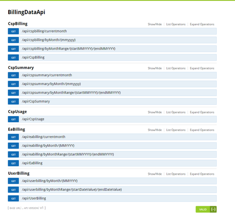

# Azure Usage Analytics
### What is Azure Usage Analytics?
Customers are continuing to expand their footprint in Azure and there is a significant need to understand resource usage, optimize it as far as possible and plan for future growth. This solution is a simple framework which abstracts the intricacies of collecting the data for different use cases (Enterprise Agreement, CSP and Direct Azure Subscriptions), persists that data and finally provides a common model which can be used for data analytics.  
### Solution Architecture 

The Solution has four components
+ Data Extraction Service (Azure API)
+ Data Aggregation Engine (Azure Web Job)
+ Persistent Data Storage (Azure database)
+ Visualizations and Analytics (Power BI)

##### Data Extraction Service (Azure API)  
We have separate sets of Rest APIs to access the usage/billing information for each type of subscription. Our Data Extraction Service provides a single place to collect Usage/Billing data for each type as desired. This component is decoupled from other components to ensure that it can be re-used as a standalone solution in itself. The following APIs are exposed via this Web Service currently

##### Data Aggregation Engine (Azure Web Job)
Azure WebJob is responsible for ensuring data is collected from these APIs at regular intervals of time and updated in our Persistent Data Storage.

##### Persistent Data Storage (Azure database)
Data is collected for different types of subscriptions and persisted in Azure database. New data is appended into the tables automatically when available as long as the web job is running.
##### Visualizations and Analytics (Power BI)
Sample Power BI reports have been provided along with the solution which access the data from Data Storage and build interesting visualizations.

_**IMPORTANT DISCLAIMER**_  
This solution is not intended as a Product. It demonstrates a possible way to collect, persist and analyze usage data. Users are free to use this solution as-is or enhance/modify the solution or to cater to specific business needs. The solution contains known issues and limitations. The users of this solution own the responsibility of ensuring the system has been thoroughly tested and verified before deploying it in Production.

